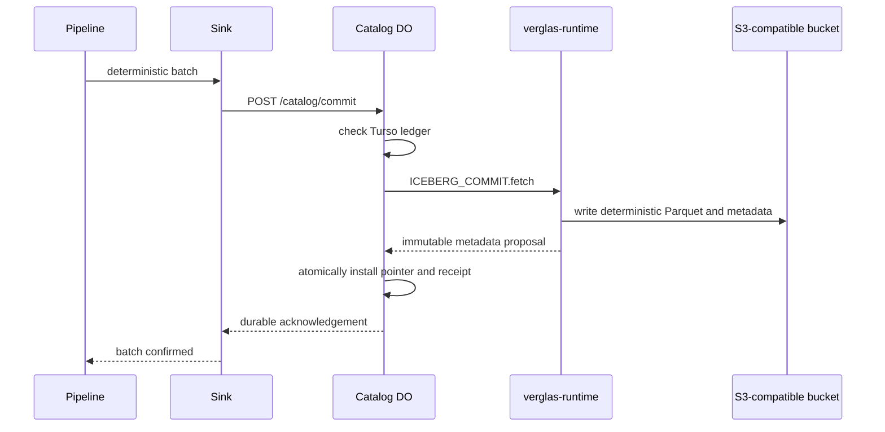

Iceberg separates a small mutable catalog pointer from immutable metadata and
data objects. Verglas preserves that distinction across product boundaries.

- **Sink** owns deterministic batch and file identities.
- **Catalog** owns namespace/table API state and its confirmed batch ledger in
  Turso.
- **`verglas-runtime`** owns the narrow privileged commit implementation and
  host-only catalog/object-storage credentials.
- **Foyer** caches immutable ranges in local DRAM/NVMe, is disposable, and is
  never authority.
- **The configured S3-compatible bucket** is the immutable Iceberg origin and
  is authoritative for published files.

## Commit path

The runtime intercepts only the declared `ICEBERG_COMMIT → verglas-runtime`
binding with `POST /catalog/commit`. Tenant WASM receives no raw network,
filesystem, provider credential, or object-store handle.

An exact retry carries the same batch, payload digest, file identity, and
current SQLite metadata location. Runtime can reproduce the immutable proposal,
but it never decides which pointer is current. Catalog installs the proposed
pointer and receipt in Turso before acknowledging Sink; later retries return
that durable receipt without another runtime call.

## Cache behavior

Reads use the exact storage binding, object version, geometry, and range as the
Foyer key. A miss fills from the configured S3 origin. Local DRAM and NVMe
contents may disappear at any time without changing durable Catalog or Iceberg
state.
