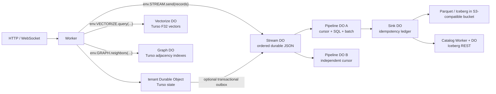

This page is the source of truth for Verglas self-hosted compute and ingestion.
The platform has exactly nine products. Each product is either tenant Worker code
or a prebuilt system deployment made from the same Worker and Durable Object
primitives. There is no separate job runtime, queue service, database runtime, or
lakehouse path hidden behind these products.

1. **Worker** — stateless public ingress.
2. **Durable Object** — serialized stateful Worker class backed by one embedded local Turso database.
3. **Stream** — a prebuilt Durable Object that durably appends JSON records.
4. **Pipeline** — a prebuilt Worker and Durable Object that consume Streams,
   execute stateless SQL transforms, batch records, and checkpoint progress.
5. **Sink** — a prebuilt Worker and Durable Object that deliver idempotent
   batches. The first sink writes Parquet files and Iceberg commits.
6. **Catalog** — a prebuilt Worker and Durable Object exposing Iceberg REST and
   serving Sink catalog operations.
7. **Vectorize** — a prebuilt Worker and Durable Object exposing the Cloudflare
   Vectorize V2 Worker binding over native Turso vectors.
8. **Graph** — a prebuilt Worker and Durable Object exposing bounded property
   graph CRUD, indexed traversal, and deterministic shortest paths.
9. **Query** — a prebuilt Worker and Durable Object that directly consumes
   Pipeline batches and maintains declared aggregate read models in Turso.
The Worker/Durable Object API is Cloudflare's; Verglas implements it over the
WASM component ABI. The Pipelines resource model follows Cloudflare's current
post-September-2025 architecture, in which Streams, Pipelines, and Sinks are
separate resources. The normative external references are Cloudflare's
[overview](https://developers.cloudflare.com/pipelines/),
[Streams](https://developers.cloudflare.com/pipelines/streams/),
[Pipelines](https://developers.cloudflare.com/pipelines/pipelines/),
[Sinks](https://developers.cloudflare.com/pipelines/sinks/), and
[Wrangler commands](https://developers.cloudflare.com/pipelines/reference/wrangler-commands/).
The deprecated legacy Pipelines architecture is not implemented.

## Topology



A Stream knows nothing about Pipelines, Sinks, Iceberg, or catalogs. A
Pipeline owns its Stream cursor. A Sink owns delivery idempotency. A Catalog
owns catalog state and the Iceberg REST boundary. Resources compose through
ordinary bindings and stub calls.

## Runtime host

`verglas-runtime` is the only serving runtime. It executes Worker and Durable
Object components through Wasmtime under `verglasd` supervision, with local
processes for development or Firecracker isolation in production. It owns local
Turso adapters and uses Foyer memory and disk tiers to cache bytes from the
configured S3 origin and compiled/runtime data. Foyer is disposable performance
state, never a commit authority.

Cell filesystem durability is authoritative for Durable Object state. The
configured S3-compatible bucket is the immutable Iceberg origin and the only
external dependency in the current architecture; writes complete at the
configured S3 origin before success. Local cache contents are disposable.

Tenant components receive no raw network, object-store, or filesystem access.
Narrow host capabilities perform privileged operations such as the Iceberg
Catalog commit after validating the caller's declared binding and object
identity. These are in-process host calls, not hidden services or an additional
product.

## 1. Worker

A Worker is the general primitive and public entrypoint. It is stateless,
pool-executed, and has no storage capability. Its module exports
`fetch(request, env, ctx)`. Environment bindings are its only authority.
Durable Objects, Streams, Pipelines, Sinks, and Catalogs are reached through
bindings, never through a hidden global client.

Public routes execute Worker code first. `/do/...` routes are internal debug
surfaces and are not a tenant API. Worker behavior remains specified by
[Cloudflare compatibility](/docs/architecture/cloudflare-compat).

## 2. Durable Object

A Durable Object is a named Worker class with strictly serialized events. Each
object owns one embedded local Turso `0.7.2` database under the self-hosted cell
data root. The database is authoritative DO state. SQL `COMMIT` followed by an
explicit WAL checkpoint is the durability fence, and cell filesystem durability
is authoritative. Cold restart reopens the same local path. DO state has no
clustering or replication.

Reserved Turso tables implement byte KV, the single alarm, WebSocket
attachments, event sequencing, and the optional Stream outbox. Tenant SQL uses
the same Turso transaction and supports ordinary SQLite-compatible DDL and DML.
The host converts rows to the WIT JSON-row boundary; no alternate mutation
format is part of the DO commit protocol.

The runtime has one storage path for DO state:

- an embedded local Turso database under the assigned cell data root;
- SQL `COMMIT` followed by an explicit WAL checkpoint as its durability fence;
- the cell filesystem as the authority for committed state; and
- no clustering or replication layer.

There is no custom SQLite pager, secondary state store, alternate SQL provider,
alternate transaction envelope, ordinary-DO-owned vector/graph mutation domain, direct
DO-to-Iceberg offload, archive batching, or object-store SQL commit path.

### Optional Stream outbox

A deployment may bind one or more Streams. Stream publication is explicit
through `env.STREAM.send(records)`. A deployment may additionally enable
committed-change publication for selected DO SQL tables. That facility uses a
transactional outbox; it is not direct offload.

For event sequence `E`, the Turso transaction writes state and deterministic
outbox rows identified by `(object-id, E, record-index)`. After SQL `COMMIT` and
the explicit WAL checkpoint complete, `verglas-runtime` sends pending rows to the
bound Stream. The Stream deduplicates those identities. Only after confirmed
Stream ingestion does the host mark rows delivered and release event effects.
A crash after Stream ingestion but before the delivered mark causes an
idempotent resend. A crash before ingestion leaves a durable pending row. An
activation drains pending rows before admitting the next tenant event.

This protocol permits temporary committed state with a pending Stream record;
it permits neither a permanent gap nor a Stream record for an uncommitted
transaction. Stream unavailability applies backpressure to a streaming-enabled
DO instead of silently dropping records.

## 3. Stream

A Stream is one specific prebuilt Durable Object class. It accepts an array of
JSON-serializable records through the Worker binding:

```js
await env.STREAM.send(records);
```

The returned Promise resolves when the Stream confirms durable ingestion. An
optional HTTP Worker accepts a JSON array at the endpoint returned by the
management API. Bearer authentication and configured CORS are endpoint
concerns, not Stream storage behavior.

Each append transaction assigns a strictly increasing per-Stream sequence and
stores the original JSON plus an optional producer record identity. A unique
producer identity makes retries idempotent. Per-Stream ordering and explicit
idempotency are Verglas guarantees; Cloudflare's current documentation does
not specify ordering or a deduplication key.

A Stream can be structured or unstructured. Structured schemas are immutable
and use Cloudflare's documented field vocabulary: `string`, `int32`, `int64`,
`float32`, `float64`, `bool`, `timestamp`, `json`, `binary`, `list`, and
`struct`. To match Cloudflare, ingestion can confirm a structurally invalid
record; processing drops it and increments the user-error metric. Exactly-once
sink delivery applies only to accepted, processable records.

One Stream may feed multiple Pipelines. Streams expose bounded reads by
sequence to authorized Pipeline stubs. They do not store consumer offsets,
execute SQL, build files, call catalogs, or offload data.

Current Cloudflare limits adopted by the management surface are a 5 MiB ingest
request and 5 MiB/s ingest rate per Stream. Retention duration and queue
capacity are not documented by Cloudflare; Verglas exposes neither until a
hard-ceiling policy is specified.

## 4. Pipeline

A Pipeline is an immutable configuration plus a prebuilt Worker and Durable
Object. Its SQL consists of one or more statements of this form:

```sql
INSERT INTO sink_name
SELECT ...
FROM stream_name
WHERE ...;
```

The implemented compatibility surface is stateless SQL: projection, aliases,
expressions, filters, `WITH`, subqueries, documented scalar functions, and one
`UNNEST` per `SELECT`. DDL, `UPDATE`, `DELETE`, joins, aggregates, windows, and
other stateful transforms are rejected. The Pipeline evaluator is isolated to
this product and is not a DO storage or commit authority.

The Pipeline DO owns an independent next-sequence cursor for each input Stream,
its current batch, retry state, and immutable SQL digest. It reads contiguous
Stream ranges, validates/decodes records, executes the transform, and groups
outputs by Sink. A batch flushes according to its configured time and size
rolling policy. The Pipeline advances its cursor only after every targeted
Sink confirms the deterministic batch identity. A crash before confirmation
retries the same batch; a crash after confirmation but before cursor advance
is harmless because Sinks deduplicate the batch.

A Pipeline contains no destination-specific Iceberg or object-store code.
Deleting it stops future flow immediately. Updating SQL is delete-and-create,
matching Cloudflare's current API.

Cloudflare does not document current retry count, backoff, dead-letter,
ordering, retention, or backpressure semantics. Verglas uses bounded
exponential retry without a dead-letter path and keeps the cursor fixed until
success. These are documented Verglas behaviors, not compatibility claims.

## 5. Sink

A Sink is an immutable configuration plus a prebuilt Worker and Durable Object.
It accepts deterministic Pipeline batches and owns an idempotency ledger. A
successful batch identity always returns the same receipt. Sink adapters do not
read Streams and do not own Pipeline cursors.

The first adapters are:

- **Iceberg Catalog Sink** — writes Parquet data files, then commits an Iceberg
  snapshot through a Catalog binding. It creates its namespace/table if absent
  and rejects binding to an existing table, matching Cloudflare's documented
  R2 Data Catalog sink. Its minimum roll interval is 60 seconds.
- **Object Sink** — a later adapter writing newline-delimited JSON or Parquet
  objects. It is not required for the first milestone.

For Iceberg, the deterministic Pipeline batch identity is stored in snapshot
summary metadata. A retry first resolves that identity through the Catalog.
This closes the crash window between the external Iceberg commit and the Sink
DO ledger update. Data files use deterministic names derived from the batch
identity, so retries cannot create additional logical rows or orphan-name
ambiguity. Exactly-once means each valid Stream record appears in a successful
Sink destination once despite process crashes and retries.

Cloudflare documents the exactly-once product guarantee but not its retry,
deduplication, or Iceberg commit mechanism. The protocol above is Verglas's
explicit implementation of that guarantee.

## 6. Catalog

A Catalog is a system Worker plus named Catalog Durable Objects exposing the
standard Iceberg REST surface. The Worker authenticates and routes REST calls;
the DO serializes namespace/table metadata changes and invokes the existing
Verglas catalog and object-storage libraries. Pipelines reach it only through
Sink bindings. Query clients use the REST Worker.

The catalog product retains the existing Iceberg domain code, authorization,
REST types, Parquet helpers, and cache integration. It does not give ordinary
DOs a direct commit, archive, or alternate mutation path. Catalog state and Sink
delivery state remain separate Durable Objects joined by deterministic Iceberg
batch identities.

## 7. Vectorize

Vectorize is a prebuilt Worker plus named Durable Object. A Worker declares the
Cloudflare binding shape and receives `insert`, `upsert`, `query`, `queryById`,
`getByIds`, `deleteByIds`, and `describe` methods on `env.<binding>`:

```toml
[[vectorize]]
binding = "VECTORIZE"
index_name = "documents"
```

One object owns immutable dimensions and metric, F32 vector values, string ids,
namespaces, metadata, metadata-index declarations, and replay-stable mutation
receipts in Turso. Mutations resolve only after the ordinary DO commit and WAL
checkpoint fence. Queries pre-filter by namespace and declared metadata, reject
more than 10,000 eligible rows, and order the bounded set with Turso native
cosine, L2, or negative-dot-product distance functions. There is no S3 Vectors,
Vamana, Puffin, Arrow mutation, or lake-offload path.

## 8. Graph

Graph is a prebuilt Worker plus named Durable Object. A Worker declares a fixed
graph identity and receives node/edge CRUD, bounded neighborhood traversal,
deterministic unweighted shortest paths, and describe methods:

```toml
[[graphs]]
binding = "GRAPH"
graph_name = "knowledge"
```

One Turso database owns relational node and edge rows, replay-stable mutation
receipts, and declared typed property indexes. Covering indexes on outbound and
inbound endpoint order serve every adjacency expansion. Node deletion removes
incident edges in the same event transaction.

Pinned Turso rejects recursive CTEs. Graph therefore has one iterative indexed
breadth-first path with hard depth, frontier, visited-node, scanned-edge,
request-byte, and response-byte ceilings. Filters use only explicitly declared
properties and apply before frontier expansion. There is no custom graph index,
recursive-query fallback, Cypher/Gremlin surface, in-memory authority, or
external graph service.

## 9. Query and stateless Dashboard

Query directly accepts the deterministic Pipeline batch protocol. It owns the
receipt and source-watermark boundary needed to update declared grouped
`count`, `sum`, `min`, and `max` views exactly once. A separate Sink would add a
second ledger without an external destination, so none exists on this path.
Declared typed endpoints compile to bounded Turso queries and expression
indexes. The materialized rows are durable product state, not a cache.

Dashboard is an ordinary stateless Worker specialization rather than a tenth
product. Semantic JSX components resolve Query bindings on demand and render
escaped server-side HTML/SVG. Foyer remains the only disposable response-cache
tier in the runtime.

## Management and observability

The self-hosted operator surface owns the public management API. This
repository defines and runs the nine-product data plane plus the strict manifest
contracts consumed by that surface; it does not mount a public `/pipelines/v1`
service.

The management API follows Cloudflare's current resource split under
`/pipelines/v1`: list/create/get/delete Pipelines, Streams, and Sinks; PATCH is
limited to Stream HTTP and Worker-binding settings. Stream schemas, Sink
configuration, and Pipeline SQL are immutable. Unknown fields are hard errors.
The setup command creates a Stream, Sink, and Pipeline and emits the Worker
binding:

```toml
[[pipelines]]
binding = "STREAM"
stream = "<stream-id>"
```

Operator metrics expose input bytes/records/decode errors. Sink metrics expose
compressed and uncompressed bytes, records, files, and Parquet row groups.
User errors expose the documented deserialization families. Ordering, queue
lag, retries, and backpressure metrics are Verglas additions and are not
presented as Cloudflare fields.

## Compatibility gaps and contradictions

Cloudflare's current documentation leaves ordering, retry policy, deduplication,
retention, capacity, backpressure, HTTP response schema, and graceful drain
undefined. It also contains contradictions: HTTP endpoint examples differ on a
`/v1` suffix; detailed sink pages differ from setup/API rolling-policy minima;
the REST schema mentions Parquet Stream input while narrative ingestion docs
specify JSON. Verglas uses the endpoint returned by management, implements JSON
Stream ingestion only, and validates sink-specific policies. These choices are
reported as Verglas behavior rather than silent compatibility claims.

## Frozen acceptance criteria

These criteria may be extended but never weakened. Their tests may not be
deleted, ignored, or stripped of assertions.

- **PP1 — Worker.** A literal Cloudflare-style Worker is the public ingress,
  executes in the stateless pool, and reaches state only through bindings.
- **PP2 — Turso Durable Object.** A literal Cloudflare-style Durable Object
  executes KV, alarm, attachments, and CREATE/INSERT/UPDATE/DELETE/SELECT through
  one embedded local Turso event transaction under the self-hosted cell data root.
  SQL `COMMIT` plus an explicit WAL checkpoint fences durability, and cold restart
  reopens the same local path. Cell filesystem durability is authoritative for
  DO state; no clustering or replication layer, custom pager, alternate SQL
  provider, alternate mutation format, or direct lake offloader remains in the
  runtime dependency graph.
- **PP3 — Stream isolation.** `send(records)` and authenticated HTTP ingestion
  durably append ordered JSON and survive restart. Two Pipelines consume the
  same Stream independently. Static dependency and behavior tests prove the
  Stream has no Sink, Iceberg, catalog, or object-offload code.
- **PP4 — crash-safe DO publication.** Kill tests cover before SQL `COMMIT`,
  after `COMMIT` before the explicit WAL checkpoint, after the checkpoint before
  Stream send, after Stream confirmation before the delivered mark, and after the
  delivered mark. Every committed selected change eventually appears in the
  Stream exactly once; no uncommitted change appears; event effects are not
  released while publication is pending.
- **PP5 — Pipeline.** Immutable `INSERT INTO ... SELECT ... FROM ...` SQL
  filters/transforms records, fans one Stream to multiple Sinks, flushes by
  configured rolling policy, retries failures, and resumes from its durable
  cursor after restart without loss. Unsupported stateful SQL fails honestly.
- **PP6 — exactly-once Iceberg Sink.** A real Pipeline writes a real Parquet
  file and commits it through the Catalog. Kill tests at every file/catalog/
  ledger/cursor boundary prove each valid input row appears once and the cursor
  never advances before Sink confirmation.
- **PP7 — Catalog product.** Iceberg REST create/load/commit runs through the
  Catalog Worker and named Catalog DO, and the Iceberg Sink uses the same
  binding rather than a private catalog path.
- **PP8 — nine-product and runtime closure.** Deployment and architecture
  inventories expose exactly Worker, Durable Object, Stream, Pipeline, Sink,
  Catalog, Vectorize, Graph, and Query. Every system resource is implemented as a prebuilt Worker/DO
  deployment on `verglas-runtime`. Retired execution and storage paths are
  absent, and ordinary Durable Objects have no direct Iceberg publication path.
- **PP9 — Cloudflare-shaped management contract.** Verglas manifests and
  self-hosted operator inputs support the create/list/get/delete API, immutable
  resource behavior, Stream binding generation, schema validation, limits, and
  metrics. The public API is an operator surface; every deliberate extension or
  documentation gap is labeled.
- **PP10 — end-to-end and regression.** JS and Python examples run Worker → DO
  → Stream → Pipeline → Iceberg Sink → Catalog after cold restart. Existing
  cache/catalog suites remain green; workspace formatting, strict clippy,
  tests, and the coverage ratchet pass.
