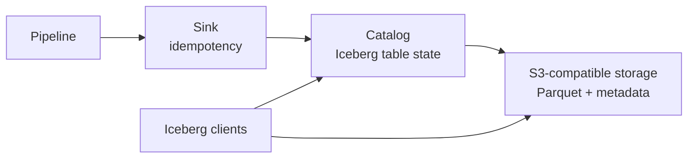

Verglas supports two common destinations for Pipeline records:

- **Sink + Catalog** publishes Parquet files and Iceberg table metadata for
  interoperable lakehouse storage.
- **Query** maintains bounded aggregate read models for application endpoints.

## Iceberg publication



The Pipeline determines when a batch is ready. The Sink validates and
deduplicates its batch identity. The Catalog publishes the table metadata only
after the immutable data and metadata objects exist. Retrying the same batch
returns the stored receipt rather than publishing a second snapshot.

Catalog implements the Iceberg REST `/v1` surface for namespace and table
list, create, load, commit, register, rename, and delete operations. Standard
Iceberg clients continue to treat the catalog and object store as the table
interface; no Verglas-specific reader is required.

## Query read models

Declare a fixed query binding:

```jsonc
{
  "queries": [
    { "binding": "ANALYTICS", "query_name": "sales" }
  ]
}
```

Call one endpoint declared by that Query component:

```js
export default {
  async fetch(request, env) {
    const url = new URL(request.url);
    const result = await env.ANALYTICS.query("revenue", {
      region: url.searchParams.get("region") ?? "all",
      days: Number(url.searchParams.get("days") ?? 30),
    });

    return Response.json(result);
  },
};
```

Use `describe()` to inspect the materialization and its source watermarks:

```js
const state = await env.ANALYTICS.describe();
```

Query definitions are immutable and operator-managed. They declare input
sources, aggregate views, typed parameters, and bounded endpoints. A Query DO
consumes deterministic Pipeline batches and durably stores both materialized
rows and replay receipts.

## Choose a destination

| Need | Destination |
| --- | --- |
| Open table format for BI, Spark, Flink, or archival | Iceberg Sink + Catalog |
| Low-latency application endpoint over maintained aggregates | Query |
| Both historical analysis and an operational read path | Fan one Pipeline into both |
