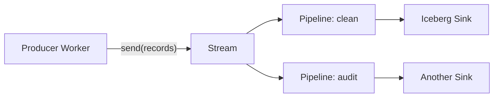

A Stream durably appends ordered JSON records. A Pipeline reads that Stream,
applies a stateless SQL transform, maintains its own cursor, and retries a
deterministic batch until every Sink confirms it.



## Send records

Declare a fixed Stream binding:

```jsonc
{
  "pipelines": [
    { "binding": "EVENTS", "stream": "commerce_events" }
  ]
}
```

Then call `send` from any Worker handler:

```js
export default {
  async fetch(request, env) {
    const event = await request.json();

    await env.EVENTS.send([{
      id: event.id,
      type: event.type,
      amount: event.amount,
      received_at: new Date().toISOString(),
    }]);

    return new Response(null, { status: 202 });
  },
};
```

`send` requires an array of JSON-serializable values, rejects requests over 5
MiB, and resolves only after the Stream returns a durable 2xx acknowledgement.
A single Stream can feed multiple Pipelines with independent cursors.

## Transform records

A Pipeline configuration selects one Stream, maps SQL destination names to
Sinks, and defines explicit row, byte, and time batch limits. The supported SQL
surface is intentionally bounded:

```sql
INSERT INTO purchases
SELECT id,
       LOWER(customer_email) AS customer_email,
       ROUND(amount * 100) AS amount_cents,
       received_at
FROM commerce_events
WHERE type = 'purchase' AND amount > 0;
```

Supported operations include projection, aliases, nested field access,
filters, arithmetic, comparisons, `WITH`, one `UNNEST` per `SELECT`, and scalar
functions such as `UPPER`, `LOWER`, `TRIM`, `ROUND`, `COALESCE`, `NULLIF`, and
`CONCAT`.

<Warning>
Pipeline SQL is not general analytical SQL. Joins, aggregates, windows,
`GROUP BY`, `ORDER BY`, DDL, `UPDATE`, and `DELETE` are rejected. Use Pipeline
for record-by-record transformation and a Query read model for maintained
aggregates.
</Warning>

## Fan out

Multiple statements can read the same source and target different Sinks:

```sql
INSERT INTO accepted
SELECT id, type, amount
FROM events
WHERE amount >= 0;

INSERT INTO rejected
SELECT id, type, amount, 'negative amount' AS reason
FROM events
WHERE amount < 0;
```

Each delivered batch has a deterministic identity derived from the Pipeline,
SQL digest, source sequence range, and Sink. The Pipeline advances its cursor
only after all destinations confirm that identity. A retry cannot create a
second logical delivery in an idempotent built-in Sink.

## Structured Streams

Streams may enforce an immutable schema with `string`, integer and float
types, `bool`, `timestamp`, `json`, `binary`, `list`, and nested `struct`.
Invalid positions stay visible in validation metrics but are skipped during
Pipeline processing without renumbering later sequence positions.
