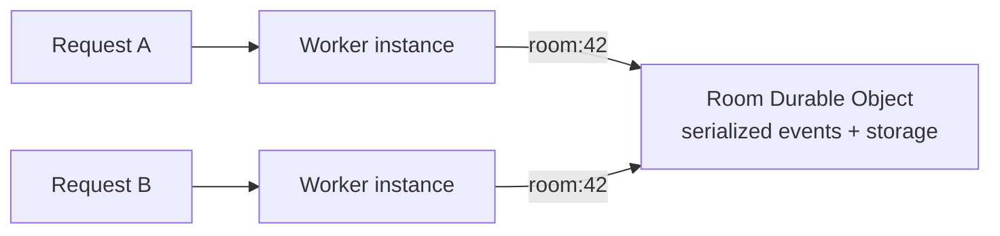
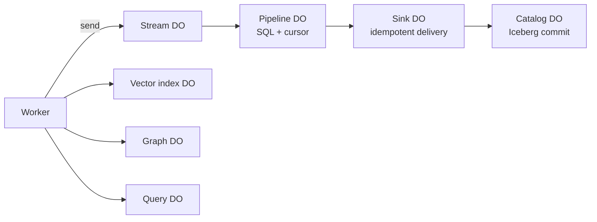

Verglas has one programming model: deploy Workers and connect them to named,
stateful components through bindings.

## Workers: stateless compute

A Worker exports handlers such as `fetch`. It has no local durable state and
can be started wherever demand arrives. That makes Workers the right place for
HTTP routing, authentication, validation, transformations, and calls to bound
components.

```js
export default {
  async fetch(request, env, ctx) {
    return new Response("ok");
  },
};
```

Verglas adds or removes Worker capacity in response to traffic. Because any
instance can handle the next request, application state belongs in a Durable
Object or another declared binding.

## Durable Objects: named state

A Durable Object combines a stable identity with serialized event handling.
Each object has durable key-value and SQL storage, alarms, and hibernatable
WebSockets. Requests for the same object name are routed to the same logical
object, so application code does not manage locks or assign partitions.



Different object names scale independently. A chat room, customer, workflow,
device, or tenant can each be its own unit of state and concurrency.

## Bindings: explicit composition

`wrangler.jsonc` declares every capability available in `env`:

```jsonc
{
  "name": "orders-api",
  "main": "worker.js",
  "compatibility_date": "2026-08-27",
  "durable_objects": {
    "bindings": [{ "name": "ORDERS", "class_name": "Order" }]
  },
  "pipelines": [{ "binding": "EVENTS", "stream": "order-events" }],
  "vectorize": [{ "binding": "SEARCH", "index_name": "products" }]
}
```

The Worker cannot discover arbitrary storage or receive cloud credentials. It
can only call the objects and services named in its manifest.

## Data path

The built-ins use the same model:



Streams own ordered ingestion. Pipelines own transforms and progress. Sinks
own delivery idempotency. Catalogs own Iceberg table state. Vector, Graph, and
Query bindings provide focused stateful APIs. These are prebuilt components,
not separate server fleets.

## Serverless responsibility split

| You define | Verglas manages |
| --- | --- |
| Worker handlers and Durable Object classes | Worker placement and capacity |
| Object names and binding declarations | Routing to the correct object |
| Schemas, transforms, and application policy | Serialized object execution and durable commits |
| Request and event behavior | Process lifecycle, isolation, and recovery |

The result is a serverless architecture from request handling through durable
data processing: code and configuration are the unit of deployment, while the
platform owns the machines.
