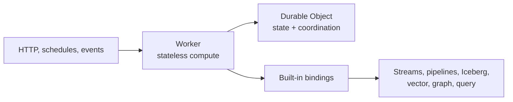

Verglas is a serverless compute and data platform built around two modern cloud
components:

- **Workers** run stateless request and event handlers.
- **Durable Objects** give a named object serialized execution, durable storage,
  SQL, alarms, and WebSockets.

The platform places and scales these components automatically. You write a
Cloudflare-compatible Worker, declare the bindings it can use, and deploy it.
There are no servers, shards, or worker pools to provision.

Streams, pipelines, Iceberg tables, vector indexes, graphs, and query read
models are built from the same Worker and Durable Object model. They are
composable bindings—not separate runtimes you have to operate.

<CardGroup cols={2}>
  <Card title="Build your first Worker" icon="rocket" href="/docs/get-started/quickstart">
    Install the CLI, log in, run locally, and deploy.
  </Card>
  <Card title="Understand the platform" icon="blocks" href="/docs/concepts/platform">
    See how Workers, Durable Objects, and bindings fit together.
  </Card>
  <Card title="Use built-in components" icon="database" href="/docs/built-ins/overview">
    Add durable state, pipelines, Iceberg, vector search, graphs, and queries.
  </Card>
  <Card title="Start from a recipe" icon="book-open" href="/docs/recipes/overview">
    Build ingestion, lakehouse, deduplication, and semantic-search flows.
  </Card>
</CardGroup>

## The programming model

An application can stay as small as one Worker, add a Durable Object when it
needs coordination or state, and add data bindings when it needs ingestion or
specialized storage. Each binding is explicit in `wrangler.jsonc`, so a Worker
only receives the capabilities you declare.

<Note>
Verglas follows the Cloudflare Workers authoring and configuration model. The
runtime executes the deployed component on Verglas infrastructure.
</Note>
