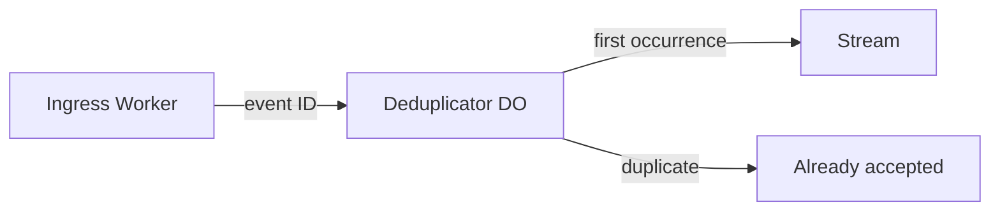

Retries are normal in event systems. When a source supplies a stable event ID,
route that ID through a Durable Object before appending the event. Serialized
execution turns the check-and-mark operation into one consistency boundary.



## Configure the object and Stream

```jsonc
{
  "durable_objects": {
    "bindings": [
      { "name": "DEDUP", "class_name": "EventDeduplicator" }
    ]
  },
  "migrations": [
    { "tag": "v1", "new_sqlite_classes": ["EventDeduplicator"] }
  ],
  "pipelines": [
    { "binding": "EVENTS", "stream": "accepted-events" }
  ]
}
```

## Implement the consistency boundary

```js
import { DurableObject } from "cloudflare:workers";

export class EventDeduplicator extends DurableObject {
  constructor(ctx, env) {
    super(ctx, env);
    this.ctx.storage.sql.exec(`
      CREATE TABLE IF NOT EXISTS accepted (
        event_id TEXT PRIMARY KEY,
        accepted_at TEXT NOT NULL
      )
    `);
  }

  async fetch(request) {
    const event = await request.json();
    const existing = this.ctx.storage.sql
      .exec("SELECT event_id FROM accepted WHERE event_id = ?", event.id)
      .toArray();

    if (existing.length) {
      return Response.json({ accepted: true, duplicate: true });
    }

    await this.env.EVENTS.send([event]);
    this.ctx.storage.sql.exec(
      "INSERT INTO accepted (event_id, accepted_at) VALUES (?, ?)",
      event.id,
      new Date().toISOString(),
    );

    return Response.json({ accepted: true, duplicate: false });
  }
}

export default {
  async fetch(request, env) {
    const event = await request.json();
    if (typeof event.id !== "string" || !event.id) {
      return new Response("event.id is required", { status: 400 });
    }

    const id = env.DEDUP.idFromName(event.id);
    return env.DEDUP.get(id).fetch("https://dedup.internal", {
      method: "POST",
      headers: { "content-type": "application/json" },
      body: JSON.stringify(event),
    });
  },
};
```

The same event ID always reaches the same object. Unrelated IDs scale across
different objects automatically.

<Note>
A Stream send from a Durable Object uses the object event's transactional
binding path. The state mutation and publication are released through the same
event boundary; a failed publication does not silently mark the ID delivered.
</Note>

## Retention choices

An indefinitely growing deduplication set is rarely necessary. Choose a policy
that matches the source's retry window:

- Keep IDs forever when they represent immutable business transactions.
- Store an expiration timestamp and use an alarm to delete old IDs when the
  source guarantees a bounded retry period.
- Hash a tenant and time bucket into the object name when one ID per object is
  too fine-grained for your workload.

This is the Durable Object equivalent of keyed state in stream processors: the
key determines the consistency boundary, but Verglas owns its placement and
lifecycle.
