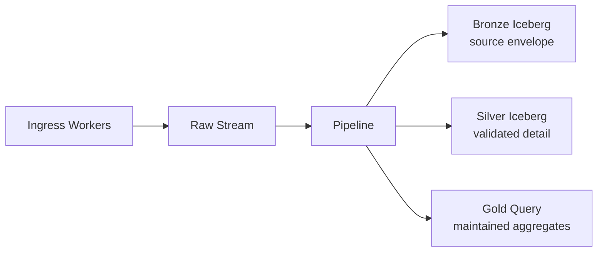

The medallion pattern separates raw data, validated detail, and business-facing
aggregates. In Verglas, those layers are resource and schema boundaries—not
clusters that stay running.



## Bronze: preserve source facts

Wrap every incoming record with source metadata before sending it:

```js
await env.RAW_EVENTS.send([{
  source: "billing",
  source_id: payload.id,
  ingested_at: new Date().toISOString(),
  payload,
}]);
```

Create `raw_events` as a structured Stream. The binding only references the
resource; the immutable schema is part of Stream creation:

```json
{
  "fields": [
    { "name": "source", "type": "string", "required": true },
    { "name": "source_id", "type": "string", "required": true },
    { "name": "ingested_at", "type": "timestamp", "required": true },
    { "name": "payload", "type": "json", "required": true }
  ]
}
```

The first Pipeline statement copies that envelope to a raw Iceberg Sink:

```sql
INSERT INTO bronze_events
SELECT source, source_id, ingested_at, payload
FROM raw_events;
```

Keep Bronze append-only. It is the input for audits and future reprocessing.

## Silver: enforce the analytical contract

A second statement filters and projects accepted records from the same durable
source sequence:

```sql
INSERT INTO silver_transactions
SELECT source_id AS transaction_id,
       payload.customer_id AS customer_id,
       ROUND(payload.amount * 100) AS amount_cents,
       payload.currency AS currency,
       payload.occurred_at AS occurred_at,
       ingested_at
FROM raw_events
WHERE payload.customer_id IS NOT NULL
  AND payload.amount >= 0
  AND payload.currency IS NOT NULL;
```

Fan invalid rows to a quarantine Sink instead of silently losing them:

```sql
INSERT INTO rejected_transactions
SELECT source_id, ingested_at, payload, 'validation failed' AS reason
FROM raw_events
WHERE payload.customer_id IS NULL
   OR payload.amount IS NULL
   OR payload.amount < 0
   OR payload.currency IS NULL;
```

## Gold: serve a business question

Attach a Query destination to the validated Pipeline output and define bounded
endpoints such as:

```js
const result = await env.SALES.query("revenue-by-currency", {
  from: "2026-08-01",
  to: "2026-08-31",
});
```

The Query Durable Object maintains declared aggregates as Pipeline batches
arrive. Use Gold for a specific dashboard or application question; keep Silver
as the reusable detailed dataset.

## Why this shape works

- One Stream sequence feeds every layer, so raw and curated outputs share a
  traceable input position.
- Sink batch IDs make Iceberg publication idempotent.
- Query replay receipts make aggregate updates idempotent.
- Each stateful component scales by its name instead of by a manually sized job
  cluster.

<Warning>
Verglas Pipeline SQL is stateless and does not implement joins, windows, or
`GROUP BY`. Use a Query definition for maintained aggregates. For multi-source
joins, normalize each source first and join with an external Iceberg engine
until a declared stateful join component is available.
</Warning>
