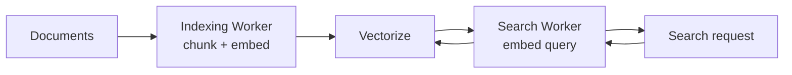

Semantic search has two paths: index content when it changes, then embed and
query user text at request time. The embedding model is external to Vectorize;
use the same model and dimensions for both paths.



## Bind the index

```jsonc
{
  "vectorize": [
    { "binding": "DOCS", "index_name": "documentation" }
  ]
}
```

The index is created with fixed dimensions and a distance metric. The example
below assumes the embedding client returns the correct dimensions.

## Index documents

```js
async function indexDocument(document, env, previousChunkIds = []) {
  const chunks = splitIntoChunks(document.text, 800);
  const vectors = [];

  for (let i = 0; i < chunks.length; i += 1) {
    const values = await embed(chunks[i], env.EMBEDDING_API_KEY);
    vectors.push({
      id: `${document.id}:${i}`,
      values,
      namespace: document.tenant_id,
      metadata: {
        document_id: document.id,
        title: document.title,
        chunk: chunks[i],
        locale: document.locale,
      },
    });
  }

  for (let start = 0; start < vectors.length; start += 1000) {
    await env.DOCS.upsert(vectors.slice(start, start + 1000));
  }

  const currentIds = new Set(vectors.map((vector) => vector.id));
  const obsoleteIds = previousChunkIds.filter((id) => !currentIds.has(id));
  for (let start = 0; start < obsoleteIds.length; start += 1000) {
    await env.DOCS.deleteByIds(obsoleteIds.slice(start, start + 1000));
  }

  return [...currentIds];
}
```

Use stable IDs so re-indexing replaces the same chunks. Persist the returned ID
list with the source document and supply it as `previousChunkIds` next time;
that removes stale vectors when a document becomes shorter.

## Serve search

```js
export default {
  async fetch(request, env) {
    const principal = await requirePrincipal(request, env);
    const { query, locale = "en" } = await request.json();
    const queryVector = await embed(query, env.EMBEDDING_API_KEY);

    const matches = await env.DOCS.query(queryVector, {
      topK: 8,
      namespace: principal.tenantId,
      returnMetadata: "all",
      filter: { locale },
    });

    return Response.json(matches);
  },
};
```

Derive the namespace from the authenticated principal, never a caller-supplied
tenant ID. Metadata filters narrow eligible records before similarity scoring.

## Add retrieval-augmented generation

For RAG, take the highest-scoring chunks, enforce an application score
threshold, and supply their text as context to a generation model. Keep source
IDs and titles in the response so the application can cite the original
document.

## Operational guidance

- Pin the embedding model. When a replacement keeps the same dimensions,
  re-embed and upsert every document. Create a new index when dimensions or the
  distance metric change.
- Batch `upsert` calls, with at most 1,000 IDs per batch operation.
- Keep sensitive full documents outside vector metadata when snippets are not
  safe to return.
- Measure relevance before tuning `topK`; more matches do not automatically
  improve answers.
- Use a Stream and Pipeline ahead of the indexing Worker when document changes
  must be retained and replayed.
