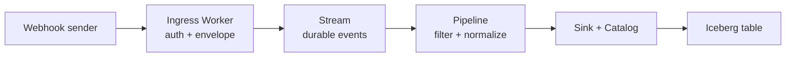

Use this pattern for payment, product, telemetry, or partner webhooks that must
be acknowledged quickly but retained for downstream analysis.



## 1. Bind the Stream

```jsonc
{
  "name": "webhook-ingress",
  "main": "worker.js",
  "compatibility_date": "2026-08-27",
  "pipelines": [
    { "binding": "WEBHOOKS", "stream": "partner-webhooks" }
  ],
  "vars": {
    "WEBHOOK_ISSUER": "partner"
  }
}
```

Store the verification secret as an encrypted deployment secret, not in
`vars`.

## 2. Verify and ingest

```js
export default {
  async fetch(request, env) {
    if (request.method !== "POST") {
      return new Response("Method not allowed", { status: 405 });
    }

    const raw = await request.text();
    const valid = await verifySignature(
      raw,
      request.headers.get("x-webhook-signature"),
      env.WEBHOOK_SECRET,
    );
    if (!valid) return new Response("Invalid signature", { status: 401 });

    const payload = JSON.parse(raw);
    await env.WEBHOOKS.send([{
      event_id: payload.id,
      event_type: payload.type,
      issuer: env.WEBHOOK_ISSUER,
      received_at: new Date().toISOString(),
      payload,
    }]);

    return new Response(null, { status: 202 });
  },
};
```

Return `202` only after `send` resolves. At that point the Stream has durably
acknowledged the record; lakehouse publication can happen independently.

## 3. Normalize in a Pipeline

```sql
INSERT INTO webhook_events
SELECT event_id,
       event_type,
       issuer,
       received_at,
       payload.customer.id AS customer_id,
       payload.data AS data
FROM partner_webhooks
WHERE event_id IS NOT NULL
  AND event_type IS NOT NULL;
```

Map `webhook_events` to an Iceberg Sink. The Sink and Catalog deduplicate
Pipeline batch identities, so a crash and retry cannot publish the same batch
as a second logical commit.

## 4. Keep the raw envelope

If audit or replay matters, fan out the same Pipeline input to a second Sink:

```sql
INSERT INTO raw_webhooks
SELECT * FROM partner_webhooks;

INSERT INTO webhook_events
SELECT event_id, event_type, issuer, received_at, payload.data AS data
FROM partner_webhooks
WHERE event_id IS NOT NULL;
```

The raw Iceberg table preserves the source envelope. The normalized table is
the stable analytical contract.

## Production checks

- Verify the signature before writing to the Stream.
- Preserve the source event ID even if deduplication happens later.
- Keep payloads below the 5 MiB Stream request limit.
- Treat schema changes as versioned data contracts.
- Alert on Stream validation errors and Pipeline cursor lag.
